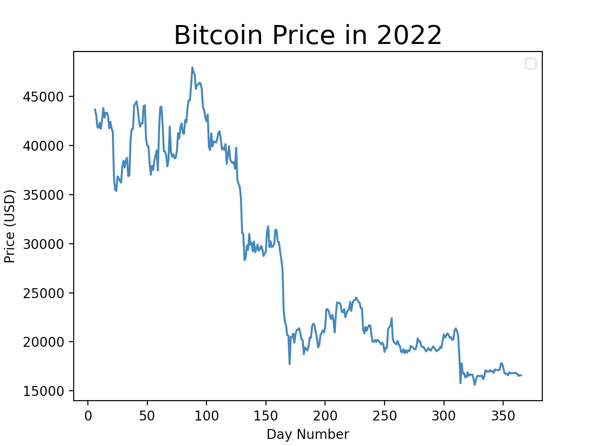
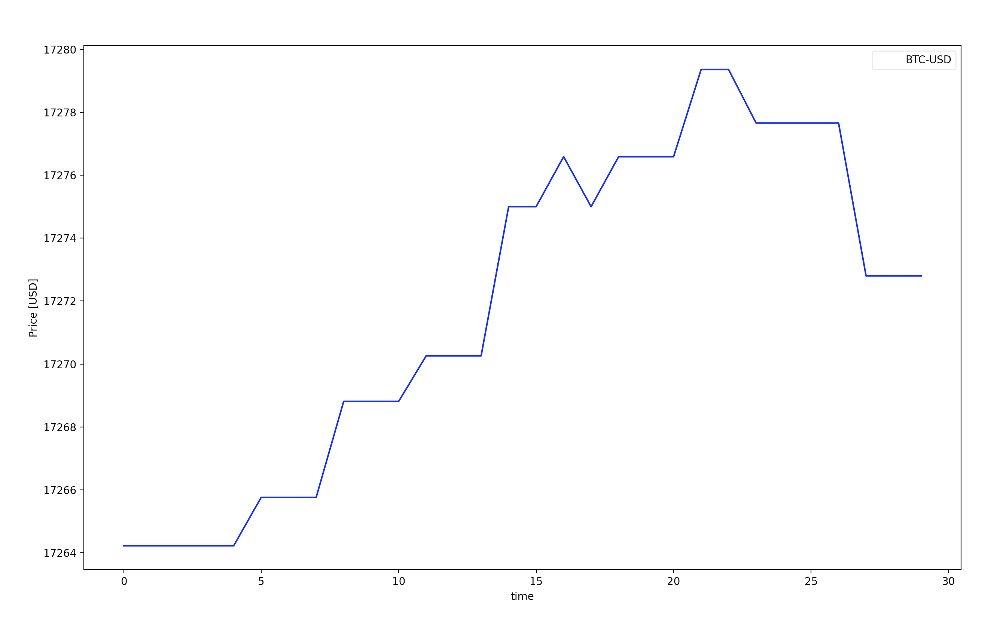

# Bitcoin-Price-Monitor
This is a Bitcoin Price Monitor written in Python. This is still a working project.

This repo has been tested on
* Windows 10, Python 3.10.4


# Example
1. Visualize history data




2. Real-time Bitcoin price monitoring



# Dependencies

- [numpy](https://numpy.org/)
- [matplotlib](https://matplotlib.org/)
- [requests](https://pypi.org/project/requests/)


# Installation

```
$ cd
$ git clone https://github.com/azjohn666/Bitcoin-Price-Monitor.git
$ cd <MAIN_DIRECTORY>
```


# Usage

To run the real-time figure and update price data,
```
$ cd <MAIN_DIRECTORY>
$ python3 example/run_Monitor.py
```
